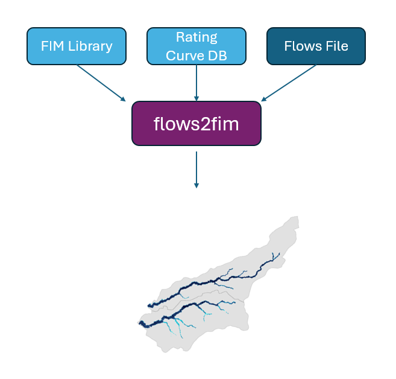

# `flows2fim`

## Overview
`flows2fim` is a command line utility program that creates composite FIMs for different flow conditions utilizing input FIM libraries and rating curves database.
`flows2fim` can work directly with FIM libraries stored on the cloud.

It has the following basic commands:

 - `controls`: Given a flow file and a rating curves database, create a control table of reach flows and downstream boundary conditions.
 - `fim`: Given a control table and a fim library folder. Create a flood inundation map for the control conditions.

The following advanced commands are available but are not commonly needed:
 - `validate`: Given a FIM library folder and a rating curves database, validate there is one-to-one correspondence between the entries of the rating curves table and FIM library objects.

### Dependencies:
 - `GDAL` must be installed and available in PATH

### Units:
Current support is for English units. The flow values must be in `cfs`

## Quick Start For Users

1. Follow install instructions at [INSTALL.md](INSTALL.md)

1. Get familiar using `flows2fim -h` and `flows2fim COMMAND -h`.

1. Download Baxter sample data from ` s3://fimc-data/flows2fim/sample_data/v0_2_0/Baxter` if you don't have a dataset already.

1. To create a control file from the 100yr flows file run `flows2fim controls -db "Baxter/ripple.gpkg" -f "Baxter/flows/flows_100yr_cfs.csv" -o "Baxter/controls_100yr.csv" -sids 2821866`

1. To create Depth VRT run `flows2fim fim -lib "Baxter/library" -c "Baxter/controls_100yr.csv" -o "Baxter/fim_100yr.vrt"`

## Quick Start For Developers

1. Clone the repository and perform the following steps from the root of the repo.

1. Download Baxter testdata from `s3://fimc-data/flows2fim/sample_data/v0_2_0/Baxter` to `testdata/Baxter` folder.

2. Launch a docker container using `docker compose up` and run the following commands inside the container

3. Run `go run main.go controls -db "testdata/Baxter/ripple.gpkg" -f "testdata/Baxter/flows/flows_100yr_cfs.csv" -o "testdata/Baxter/controls_100yr.csv" -sids 2821866` This will create a controls.csv file

4. Run `go run main.go fim -lib "testdata/Baxter/library" -c "testdata/Baxter/controls_100yr.csv" -o "testdata/Baxter/fim_100yr.vrt"` This will create a VRT file. VRT can be tested by loading in QGIS.

#### Testing

1. Run `go test ./...` to run automated tests.

#### Building

Run `./scripts/build-linux-amd64.sh` This will place the executable in `builds/linux-amd64`.

## Installation
[Installation](INSTALL.md)

## Examples
[Examples](EXAMPLES.md)

